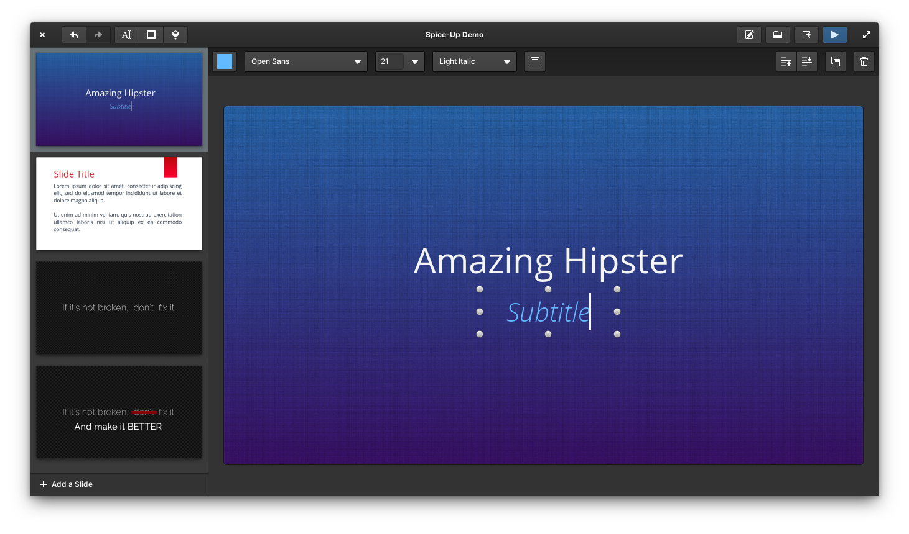
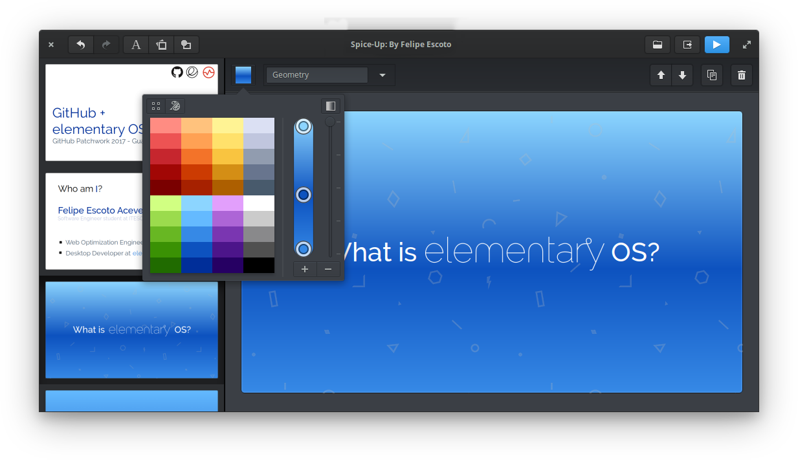
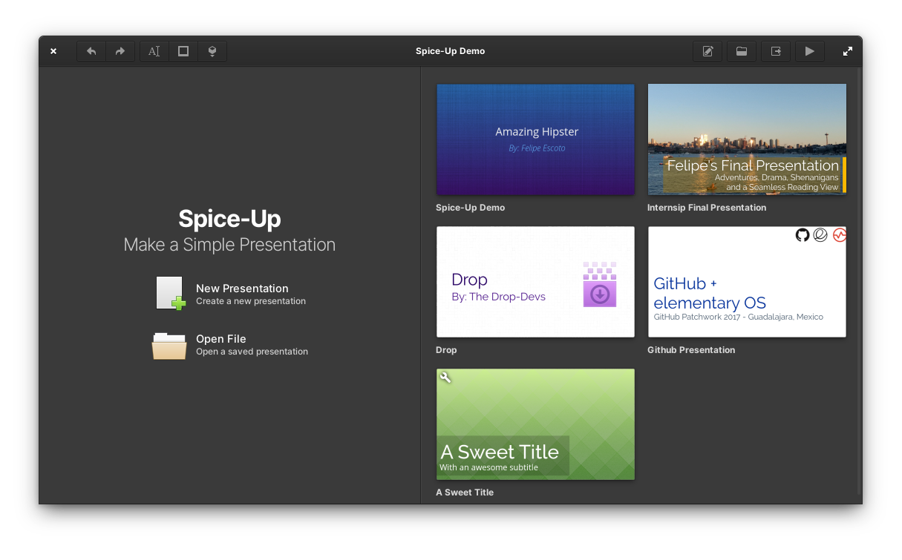

<div>
  <h1 align="center">Spice-up</h1>
  <h3 align="center">Create Simple and Beautiful presentations</h3>
</div>

<br/>

<p align="center">
  <a href="https://appcenter.elementary.io/com.github.philip-scott.spice-up">
    
  </a>
</p>


<br/>

<p align="center">
    
</p>

<h2> </h2>

<p>
<a href="https://www.bountysource.com/trackers/44752823-philip-scott-spice-up">
    
</a>

</p>

Create presentations that stand out! Spice-Up has everything you need to create simple and beautiful presentations. Get your ideas across with beautiful designed templates, or start from scratch with a blank canvas. Either way, you will add some spice to your presentations with a wide variety of background patterns and a beautiful color palette.

### Spice Presentations Look Amazing!
Images, Shapes, Text, as well as beautiful background patterns and easy to make custom gradients!

<p align="center">
    
</p>

Easy-to-design slides and powerful features:


- **Exporting to PDF:** Share your presentation with anyone, no matter the platform they're at.
- **Presentation Browser:** Scroll though the presentations you have made and jump right into them with one click!.
- **Controller Support:** If you have a USB or Bluetooth controller, plug it in and control your slides!
- **Web Viewer:** Presentations can now be viewed from a web browser if Spice-Up is not installed, even if you're not using Linux. No extra software needed!
- **Edit images** in your favorite editor, and it will automatically update when saved
- **Templates:** a touch of creativity is all you need to make presentations in a blink of an eye.
- **Presenter Notes:** Present like a pro with slide-by-slide notes only viewable by you!
- And much more!

<p align="center">
    
</p>

## Installation

[](https://appcenter.elementary.io/com.github.philip-scott.spice-up)

On elementary OS? Hit the button to get Spice-Up!

#### Not on elementary?
You can install Spice-Up from a PPA. But be aware that your results may vary

    sudo add-apt-repository ppa:philip.scott/spice-up-daily
    sudo apt-get update
    sudo apt-get install com.github.philip-scott.spice-up

## Dependencies
These dependencies must be present before building
 - `gtk+-3.0>=3.9.10`
 - `granite>=0.4.1`
 - `json-glib-1.0`
 - `gee-0.8`
 - `gudev-1.0`
 - `libevdev`
 - `libsoup-2.4`

## Building

```bash
mkdir build/ && cd build
cmake ..
make && sudo make all test install
```

### Building with Flatpak

```bash
# If you are not running elementary OS Odin (0.6), add their flatpak repo
sudo flatpak remote-add --if-not-exists --system appcenter https://flatpak.elementary.io/repo.flatpakrepo

# Install build and runtime environment
sudo flatpak install -y appcenter io.elementary.Platform io.elementary.Sdk

# Build the app's flatpak
flatpak-builder build com.github.philip-scott.spice-up.yml --user --install --force-clean

# Run the app
flatpak run com.github.philip_scott.spice-up
```

<p align="center">
    
</p>
