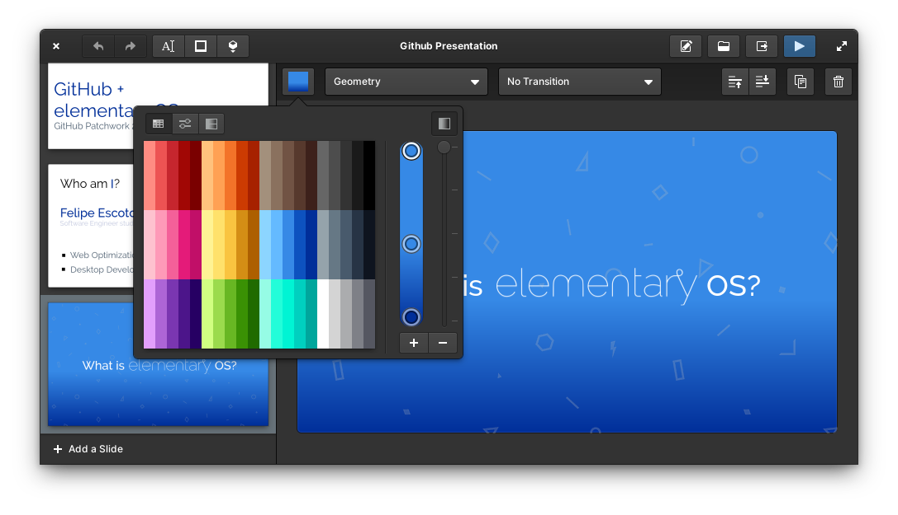

<div>
  <h1 align="center">Spice-up</h1>
  <h3 align="center">Create Simple and Beautiful presentations</h3>
</div>

<br/>

<p align="center">
  <a href="https://appcenter.elementary.io/com.github.philip-scott.spice-up">
    
  </a>
</p>

<br/>

<p align="center">
    
</p>

<h2> </h2>

<p>
<a href="https://www.bountysource.com/trackers/44752823-philip-scott-spice-up">
    
</a>
</p>

Spice-up is a modern and intuitive desktop presentation app based upon [SpiceOfDesign's presentation concept](http://spiceofdesign.deviantart.com/art/New-Presentation-Concept-401767854). Built from the ground up for elementary OS, it gives you everything you need to create simple and beautiful presentations.

### Spice Presentations Look Amazing!
Images, Shapes, Text, as well as beautiful background patterns and easy to make custom gradients!

<p align="center">
    
</p>

Its features include:

- **Exporting to PDF:** Share your presentation with anyone, no matter the platform they're at 
- **Presentation Browser**: Scroll though the presentations you have made and jump right into them with one click!.
- **Controller Support**: If you have a USB or Bluetooth controller, plug it in and control your slides!
- **Templates**, so you can whip up a presentation in a blink of an eye.
- **Edit images** in your favorite editor, and it will automatically update when saved
- **Web Viewer**: Presentations can now be viewed from a web browser if Spice-Up is not installed, even if you're not using Linux
- And much more!

<p align="center">
    
</p>

## Installation

[](https://appcenter.elementary.io/com.github.philip-scott.spice-up)

On elementary OS? Hit the button to get Spice-Up!

#### Not on elementary?
You can install Spice-Up from a PPA. But be aware that your results may vary

    sudo add-apt-repository ppa:philip.scott/spice-up-daily
    sudo apt-get update
    sudo apt-get install com.github.philip-scott.spice-up

### Donations
Liked Spice-up? Would like to support its development of this app and more? Feel free to [leave a little tip :)](https://www.paypal.com/cgi-bin/webscr?cmd=_s-xclick&hosted_button_id=WYD9ZJK6ZFUDQ) or support my work torwards a new feature over at [Bountysource](https://www.bountysource.com/trackers/44752823-philip-scott-spice-up). I'd really appreciate it :) 

## Dependencies
These dependencies must be present before building
 - `gtk+-3.0>=3.9.10`
 - `granite>=0.4.1`
 - `json-glib-1.0`
 - `gee-0.8`
 - `gudev-1.0`
 - `libevdev`

## Building
```
mkdir build/ && cd build
cmake ..
make && sudo make all test install
```
